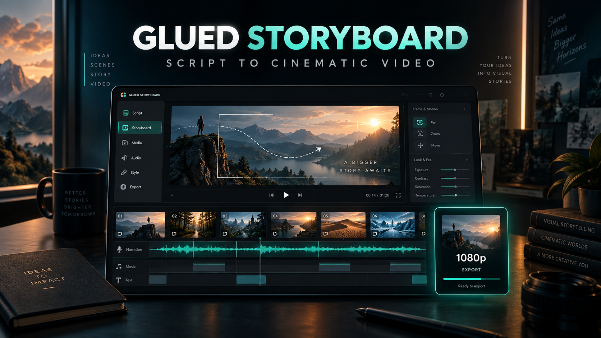

# Glued Storyboard Studio

[](https://github.com/thelocation-01/glued-storyboard/actions/workflows/ci.yml)
[](LICENSE)
[](#requirements)



Glued Storyboard turns a narration script and a folder of still images into a downloadable 1080p H.264/AAC video. It runs locally, creates one continuous Kokoro Bella narration track, and combines stable photo motion with restrained editorial graphics instead of a static or shaky slideshow.

The community edition is open source under MIT. A separate **Glued Storyboard Creator Kit** adds production templates, prompt systems, trackers, reusable AI-news structures, and a guided commercial workflow. The paid kit does not hide or relicense the free source code.

## Highlights

- Script-to-scene storyboard creation
- Ordered import of PNG, JPG, and WebP images
- Local Kokoro `af_bella` narration with warm cinematic pacing
- Tightened sentence gaps for more continuous delivery
- Stable slow zoom, zoom-out, and sideways pan presets
- Automatic chapter, statistic, question, contrast, and keyword callouts
- Documentary depth treatment, word-by-word caption emphasis, scene counter, and progress line
- Minimal, Documentary, and Kinetic visual-energy presets
- Editable scripts and scene timing
- Lumen and Glued storyboard ZIP import with ZIP-slip protection
- Local Remotion rendering to a YouTube-ready 1920x1080 MP4
- No OpenAI API key and no cloud upload required

## What Glued does not include

Glued does not generate images by itself, supply stock media or music, guarantee platform monetization, or include AI-service credits. You bring images that you generated or licensed. The app renders locally after its dependencies and voice model have been installed.

## Requirements

- Windows 10 or 11
- Node.js 22 or newer
- Python 3.12
- Approximately 2 GB of free disk space for dependencies, the local voice model, and rendering

## Install

Clone or download the repository, open PowerShell in its folder, and run:

```powershell
powershell.exe -NoProfile -ExecutionPolicy Bypass -File .\Setup-Glued-Storyboard.ps1
```

The setup script installs Node and Python dependencies, downloads the Kokoro ONNX model and voice bank from the upstream release, and verifies both files with pinned SHA-256 hashes.

After setup, double-click `Start-Glued-Storyboard.cmd`. The launcher opens the first available local address from `http://localhost:3210` through `http://localhost:3219`.

See [Installation and troubleshooting](docs/INSTALL.md) for the full checklist.

## Create a video

1. Choose **New video from script**.
2. Enter a title and paste the complete narration script.
3. Choose **Create storyboard from script**.
4. Generate or source the requested images and save them as `001.png`, `002.png`, `003.png`, and so on.
5. Choose **Import images**. Glued places them into scenes in filename order.
6. Keep **Bella — warm and cinematic** selected and choose **Create continuous narration**.
7. Use **Editorial motion** to choose the visual energy, callout frequency, accent colour, and story-progress line.
8. Render a 24-second preview, then choose **Render 1080p**.

Projects, imported images, narration files, and rendered videos remain local and are ignored by Git.

## Bella voice configuration

The production voice is defined in `voice.config.json`:

- Provider: `kokoro-onnx-local`
- Voice: `af_bella`
- Language: `en-us`
- Default speed: `0.85`
- Sample rate: `24000`

Glued compresses long silent gaps after synthesis while retaining short natural pauses. The voice remains synthetic: follow the disclosure rules of the platform where you publish.

## Verification

```powershell
pnpm install --frozen-lockfile
pnpm verify
```

`pnpm verify` runs the TypeScript check and validates release metadata, required files, voice configuration, editorial-overlay planning, and excluded private/generated paths.

## Privacy and security

- Glued binds to a local port and does not require an account.
- Scripts and media are stored inside the local project folder.
- `.env` files, project data, downloaded models, generated media, and renders are excluded from Git.
- Imported ZIPs are checked for unsafe paths and uncompressed size before extraction.

Read [Privacy](docs/PRIVACY.md), [Security](SECURITY.md), and [Publishing responsibly](docs/PUBLISHING.md) before distributing videos.

## Licences

Glued Storyboard source code is MIT-licensed. Third-party packages keep their own licences. The setup script downloads, rather than republishes, the Kokoro model files. The upstream `kokoro-onnx` runtime is MIT-licensed and the Kokoro model is Apache-2.0 according to the upstream project. Review the current upstream terms before commercial redistribution.

## Community edition and Creator Kit

The public repository contains the complete Glued Storyboard community application. The paid Creator Kit is a convenience and production-workflow bundle containing:

- a versioned copy of the community app;
- AI-news and documentary script blueprints;
- scene-image prompt systems;
- source, rights, production, and upload trackers;
- guided setup and first-video instructions; and
- commercial-use rights for the paid templates in original and client projects.

Buying the kit is optional. It does not grant exclusive rights to the MIT application, promise views or income, include media/AI credits, or guarantee YouTube monetization.

## Contributing

Issues and pull requests are welcome. Read [CONTRIBUTING.md](CONTRIBUTING.md) before submitting a change.
